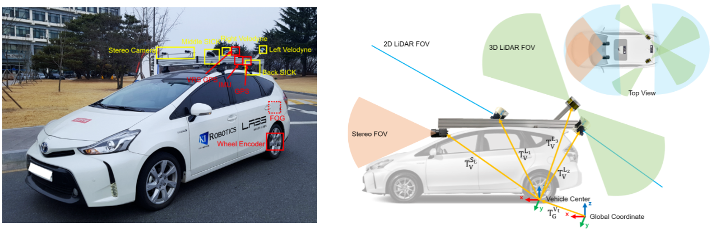
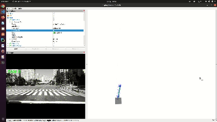

# PL-VIWO
A Lightweight and Robust Point-Line Monocular Visual Inertial Wheel Odometry

**Authors:** [Zhixin Zhang](https://happy-zzx.github.io/ZhixinZhang.github.io/), [Wenzhi Bai](https://wenzhibai.github.io/), [Liang Zhao](https://scholar.google.com.au/citations?user=1OagsSYAAAAJ&hl=en) and [Pawel Ladosz](https://scholar.google.com/citations?user=fSEWVN8AAAAJ&hl=en)

## Video


## Related Papers
The paper is under review.

## Test Environment
We use the [KAIST Complex Urban Dataset](https://sites.google.com/view/complex-urban-dataset) to test our algorithm.

Examples on KAIST Urban27:


### Dependencies
* OpenCV 4.2
* Eigen 3
* ROS noetic

## Build and Source
First, clone the code of [MINS](https://github.com/rpng/MINS/tree/master).
```
mkdir -p $MINS_WORKSPACE/catkin_ws/src/ && cd $MINS_WORKSPACE/catkin_ws/src/
git clone https://github.com/rpng/MINS
cd .. && catkin build
source devel/setup.bash
```
Then  copy the PL-VIW to the src folder and build again.
```
cd $MINS_WORKSPACE/catkin_ws/src/ && cd $MINS_WORKSPACE/catkin_ws/src/
git clone https://github.com/rpng/MINS](https://github.com/Happy-ZZX/PL-VIWO.git
cd .. && catkin build
source devel/setup.bash
```
## Run Examples
**Note❗**: This system is based on a monocular setup, please set the camera number to 1 in the Config file.

```roslaunch viwo rosbag.launch config:=kaist/kaist_C path_gt:=urban26.txt path_bag:=urban26.bag```

```rviz -d PL-VIWO/launch/display.rviz```


For the rosbag files and ground truths used for test, please refer to [MINS](https://github.com/rpng/MINS/tree/master).

## Benchmark
For the benchmark used in our paper, we also open-source the modified version for the convenience of the community. The difference is add KAIST datasets Config file and disabled some functions, like loop closure or re-localization.
The code will coming soon.

## Acknowledgements
This project was built on top of the following works.
* [OpenVINS](https://github.com/rpng/open_vins): Open-source filter-based visual-inertial estimator.
* [MINS](https://github.com/rpng/MINS/tree/master): An efficient, robust, and tightly-coupled Multisensor-aided Inertial Navigation System (MINS)

  
Thanks for the wonderful work and open-source from [Robot Perception & Navigation Group (RPNG)](https://github.com/rpng). 
