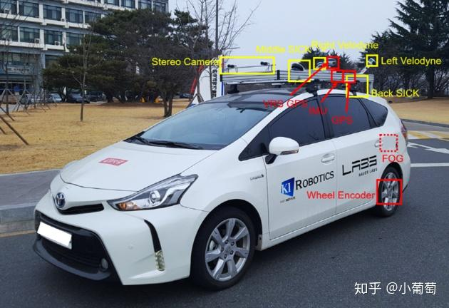

# PL-VIWO
A Lightweight and Robust Point-Line Monocular Visual Inertial Wheel Odometry

**Authors:** [Zhixin Zhang](https://happy-zzx.github.io/ZhixinZhang.github.io/), [Wenzhi Bai](https://wenzhibai.github.io/), and [Pawel Ladosz]()

Thanks for the wonderful work and open-source from [Robot Perception & Navigation Group (RPNG)](https://github.com/rpng). 
## Related Papers
The paper is under review.

## Test Environment
We use the [KAIST Complex Urban Dataset](https://sites.google.com/view/complex-urban-dataset) to test our algorithm.

### Dependencies
* OpenCV 4.2
* Eigen 3
* ROS noetic


```bibtex
@article{Lee2023arxiv,
    title        = {MINS: Efficient and Robust Multisensor-aided Inertial Navigation System},
    author       = {Woosik Lee and Patrick Geneva and Chuchu Chen and Guoquan Huang},
    year         = 2023,
    journal      = {arXiv preprint arXiv:2309.15390},
    url          = {https://github.com/rpng/MINS},
}
```

## Acknowledgements
This project was built on top of the following works.
* [OpenVINS](https://github.com/rpng/open_vins): Open-source filter-based visual-inertial estimator.
* [MINS](https://github.com/rpng/MINS/tree/master): An efficient, robust, and tightly-coupled Multisensor-aided Inertial Navigation System (MINS)
